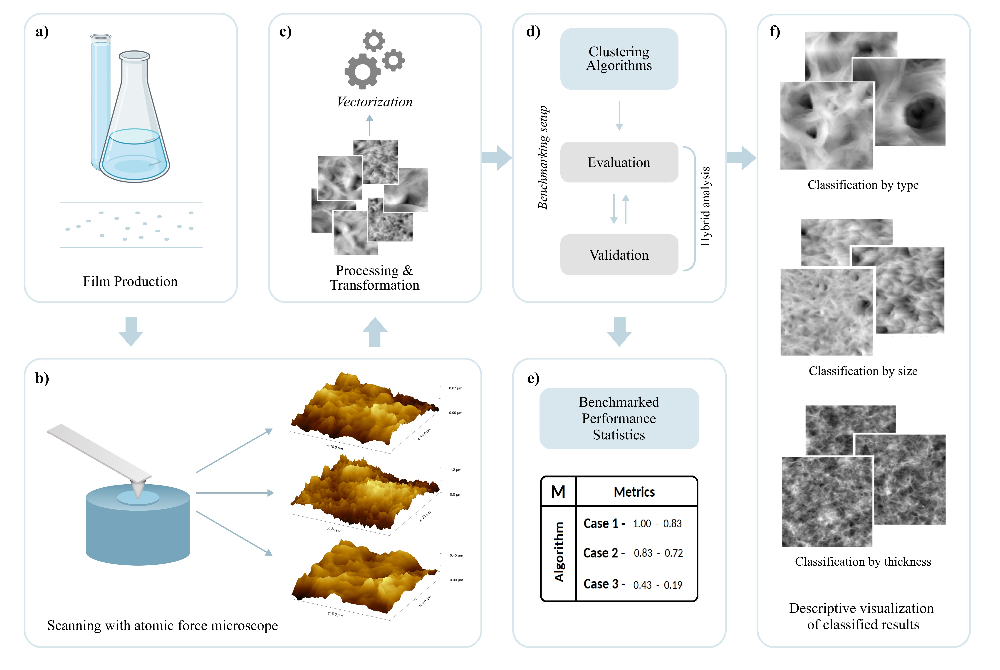
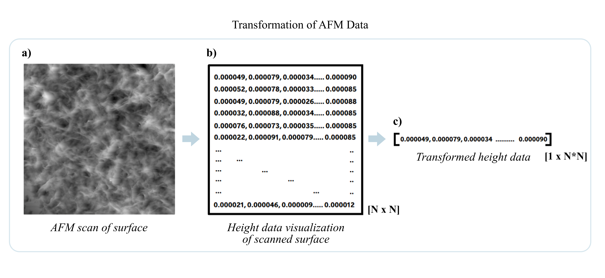

# MicroClust


### *MicroClust V1.0* is a python based toolbox that performs classificaiton of small scale surface images using Unsupervised clustering algorithims

Images from Atomic force microsope (AFM), scanning electorn microsope (SEM) etc, can be classifed using 12 of the most widely used clustering algorithims and further validated using Ground truth and self-evaluatory metrics. The toolbox can perform a 1D and 2D Fourier transform on the image data prior to classification. 


#### Algorithims available are: 
 1. K Means 
 2. K Means ++ 
 3. K Means Bisect
 4. Hierarchy 
 5. Fuzzy C Means
 6. Spectral 
 7. DBSCAN (Automated & Manually tuned) 
 8. HDBSCAN 
 9. Mean Shift
 10. OPTICS
 11. Affinity Propagation
 12. BIRCH 

#### Metrics available: 
Ground Truth evaluation: 
 1. Rand Index
 2. Adjusted Rand Index
 3. Adjusted Mutual Information Score
 4. Homogeneity
 5. Completeness
 6. V Measure
 7. Fowlkes Mallows Score
    
Self-Evaluation:
 1. Silhouette Score
 2. Calinski Harabasz Index
 3. Davies Bouldin Index


The **V1.0** version is a first level iteration of the toolbox. here, the input provided from the user is the ```path``` to the directory of images to be classifed. The output produced is a visualization of the clusters genearted and the generated scores of each metric. 
Algorithims 1 to 6 are implicitly tuned (i.e. internally tuned) and only require the expected number of clusters to be provided, where as algorithms 7 - 12 are explicitly tuned (i.e. tuned by users requirements) and require more information to be provided such as the minimum number of neighours to be considered a centroid point etc. 

This toolbox is a part of the work ***"Benchmarking Unsupervised Clustering Algorithms for Atomic Force Microscopy  Data on Polyhydroxyalkanoate Films"***


 # Simulation Results

The experiments & results from the work [LINK TO PAPER](LINK TO PAPER) is available in the simulations folder as Python Notebooks. The **Algorithms have already been tuned** to the respective data and perform as in the article. The dataset used for sinmulations is available at [](https://doi.org/10.5281/zenodo.10649355)

An Overview of the simulations performed is shown in the figure below:




The following image visualizes the transformation performed within the toolkit to feed data to the algorithms




The **Simulation** directory consists of three cases of experiments where specific features of the AFM data were being sought. 
 - Case 1 - Classification of the AFM data as per ***scan size***
 - Case 2 - Classification of the AFM data as per ***polymer type***
 - Case 3 - Classificaiton of the AFM data as per ***thickness of films***

Under each case, the simulations are further divided into specific sub-cases (A,B,C,D) based on the pool of data used for classification. The contents of the folders include: 
 - The visualizations of the initial scans & their classified results
 - Benchmarked scores of all metrics
 - Graphical visualization of Hierarchial relation


Futher, usage & features of the toolkits are explained in the sections below. 


# How to use the toolbox.?

Instructions to ***1.0V*** of the toolkit:

- *Installation:*
```
git clone https://github.com/maddoxx02/MicroClust
```
``` git clone https://github.com/maddoxx02/MicroClust <YOUR CUSTOM DIRECTORY>```
(Future, versions will have ```pip install```)
*For dependencies scroll to the end of the readme.*

- *Import & usage:*
```
import sys
sys.path.insert(1,'Y:\MicroClust')
```
```sys.path.insert(1, <DIRECTORY OF MICROCLUST INSTALLATION>)```


- *Loading Data*
To load data into your workspace, use:
```
import Worker.DATA_READER as DR
```
```
data, original, adrs = DR.reader(<DIRECTORY OF AFM DATA>)
```
where, 
```data``` stores the data in the vecotrized format as shown in the previous section. The raw data is used computation and metric calculation. 
```original``` is used to create visualizations of the data fed (before and after classification).
```adrs``` is a dictionary to store the individual ```path``` of each file being used (as a reference).

- *Peforming 1D and 2D Fourier Transforms*
```
One_Data = DM.Process_1D_F(original)
Two_Data = DM.Process_2D_F(original) 
```

- *Plotting Initial set of data*
```
import Worker.INITIAL_PLOTTER as IPLOT         
import Worker.FINAL_PLOTTER as FPLOT           
```
where, 
```IPLOT.plotter(original)``` is used to create a single visualization of all images provided before classification
```FPLOT.plotter(list(clustered labels), original)``` creates images of each cluster with elements within


- Performing Operations
 1. ***Algorithms***

Each algorithm in the toolkit can be called individually, to improve readability & ease of access the algorithms are split into two groups:

 a. ***Implicitly Tuned*** (internally tuned algorithms) - These algorithms require the final number of clusters to be provided as input
```
ALG.K_MEANS(data, <NO_CLUSTERS>)
ALG.K_MEANS(data, <NO_CLUSTERS>) 
ALG.K_MEANS_PLUS(data, <NO_CLUSTERS>)
ALG.K_MEANS_BISECT(data, <NO_CLUSTERS>)
ALG.FUZZY_C(data, <NO_CLUSTERS>)
ALG.SPECTRAL(data, <NO_CLUSTERS>)
ALG.HIERARCHY(data, ALG.HIERARCHY(data, <NO_CLUSTERS>, <GRAPH>)  
```
Where, 
- ```K Means, K Means ++ & K Means Bisect``` is set to have maximum iterations of ***300*** with ***10*** initializations, while K Means bisect follows the ***Greedy approach*** for cluster centre initialization and a bisecting strategy of ***Biggest Inertia***

- ```Fuzzy C Means``` has a degree of Fuzziness ***2*** and maximum iterations of ***300***
  
- ```Spectral aglorithm``` utilizes ***arpack*** decomposition strategy with ***10*** initializations and ***Radial basis function*** to calculate affinity
  
- In hierarchy algorithm uses an ***Euclidean affinity metric*** and a ***ward*** linkage criteria , ```<GRAPH>``` can be either ```1``` or ```0```, to produce a dendogram graph of the clustered results or not. 


 b. ***Explicitly Tuned*** (manually tuned algorithms) - These algorithms require additional hyperparameters to be tuned by the use before usage
```
T0_A7 = ALG.DBSCAN_AUTO(data, 2, 4)
T0_A8 = ALG.DBSCAN_MANUAL(data, 0.0001, 4)      
T0_A9 = ALG.HDBSCAN_MANUAL(data, 2, 2, 0)
T0_A10 = ALG.MEAN_SHIFT(data, 0.00012)
T0_A11 = ALG.OPTICS_AUTO(data, 4)     
T0_A12 = ALG.AFFINITY(data,0.999)
T0_A13 = ALG.BIRCH(TWO_Data, 3, 0.00001, 50)


```

 
 
 2. ***Metrics***

  
To import algorithims, intialize: 
```
import Algorithms.ALG as ALG 
```
You can then use the requried algorithm from the list, with 


### Additional tools

Within MicroClust, there are two scripts to perform conversion operations from Gwyddion format data (.txt) to MicroClust compatible format (.csv). These scripts can be used on the dataset mentioned earlier. 

 - ***TXT2CSV.py*** : Script to convert Gwyddion format of data ***(.txt) to (.csV)*** (i.e. the dimension of the file remains unchanged)
   The script takes the ```path``` of the directory containing the (.txt) files as input and creates a folder named ```CSV``` within which all (.csv) files are stored. 
 
 - ***CSV2IMG.py*** : Script to export ***(.csv)*** format of data to ***(.png)*** images (of the surface)
   The script takes the ```path``` of the directory containing the (.csv) files as input and creates a folder named ```IMG``` within which all (.png) images are stored. 


```
import 
```


# Citing the toolbox:
If you use this toolbox, pLease cite using: 


## Requirements 
This toolbox requires the following libraries to run: 
 1. Sklearn (1.3.0)
 2. [Fuzzy C Means](https://github.com/omadson/fuzzy-c-means)(1.7.0)
 3. Numpy (1.22.4)
 4. Seaborn (0.11.2)
 5. skimage (0.19.2)
 6. matplotlib (3.5.2)
 7. kneed (0.8.2)

