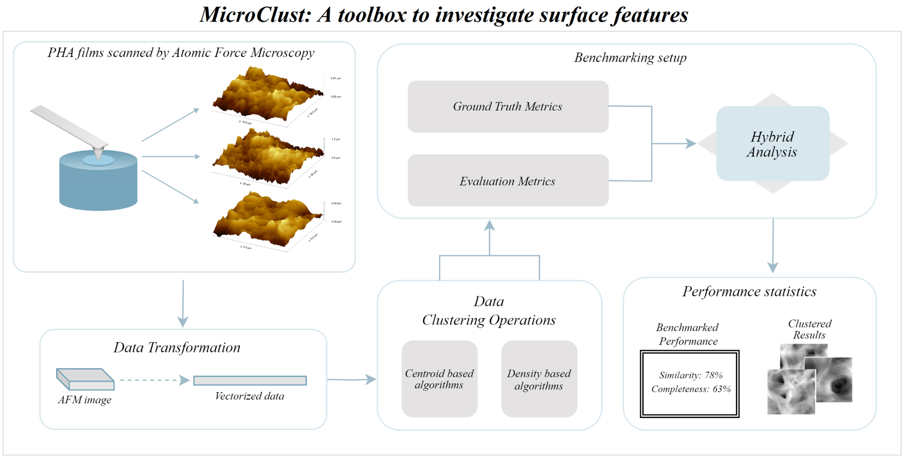

# MicroClust

! BADGES

### *MicroClust V1.0* is a python based toolbox that performs classificaiton of small scale surface images using Unsupervised clustering algorithims

such as from Atomic force microsope (AFM), scanning electorn microsope (SEM) etc via specific global con

 The tooblbox features 12 algorithims and 10 metrics that can be used to evaluate the performance and accuracy of the generated results. 

A Tool that aims to serve chemsists & give them insight on their AFM scans for further analysis. In-Progress...

